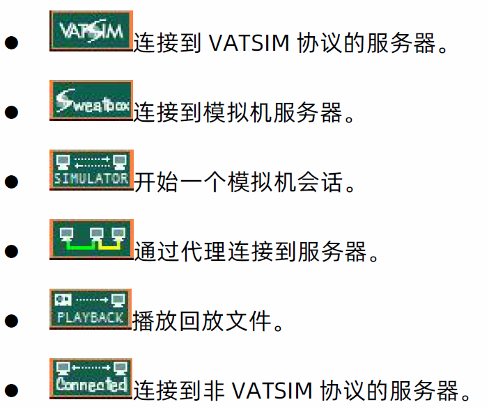

# 📚README / 必读文件


## 一、 项目简介🌟
FSD 是一个用于连接管制和机组的一个后端处理软件，使用FSD V3.000 draft 9协议。受限于FSD V3.000 draft 9协议所致，目前连接设备仅支持`EuroScope`、`Swift`以及`Echo`（未测试，仅推断得出），其余软件譬如：`Vatspy`、`VRC`、`CRC`等均不支持。

FSD V3.000 draft 9协议最初版本的是[kuroneko/fsd](https://github.com/kuroneko/fsd)，项目克隆自：[AFcPPe/FSD-SKYline](https://github.com/AFcPPe/FSD-SKYline)，目前来看这两个项目都已停止维护。💤

除此以为，目前还有基于FSD V3.000 draft 9协议的[cfcsim/pyfsd](https://github.com/cfcsim/pyfsd)，它与原版有非常大部分的改动，基本就是完全覆写了一遍，密码存储在数据库。🔒

FSD主流的协议有三种：FSD V3.000 draft 9、Vatsim协议、Vatsim（token）协议。

Vatsim协议是指在`EuroScope`中，出现下图的第一个图标。

而Vatsim（token）协议，则是在Vatsim协议的基础上面增加了token验证。

因此，目前的Vatsim协议大部分都是带有token验证的，总不可能让管制用着旧版的`EuroScope`连接你的服务器，就因为没做token。



总而言之，言而总之，此项目[supermastergui/FSD](https://github.com/supermastergui/FSD)目的就是为了写一个适合懒人的FSD，懒到不想配置数据库，使用明文储存密码（虽然安全性有点欠佳⚠️）。


## 二、 编译和运行🛠️

### (1) 前期条件📋

- CMake

- C++ 编译器

- Windows / Linux

- 放行`6809`、`3011`、`3010`需要去服务器后台放通，TCP协议。

  > [!NOTE]
  >
  > 如果服务器为腾讯云且同时装了宝塔面板，需要在腾讯云防火墙和宝塔同时放行。

### (2) 编译（仅限Linux）🐧

1. 进入`项目文件夹根目录`

   ```sh
   cd "www\*"
   ```

2. 创建`Build`文件夹

   ```sh
   mkdir build
   ```

3. 移动到`Build`文件夹

   ```sh
   cd build
   ```

4. 生成构建文件：

   ```sh
   cmake ..
   ```

5. 编译项目：

   ```sh
   make
   ```

编译完成后，会在`Build`文件夹内，出现一个"`FSD`"。是的，编译结束的文件没有任何后缀。

### (4) 修改配置⚙️

运行FSD需要将"`项目目录下的\Linux`"所有文件，以及编译完成的"`FSD`"，放在一个文件夹内，比如"`FSD_server`"，接下来我们进行文件的配置。

1. `cert.txt`

   打开`cert.txt`会显示以下的文字：

   ```
   ;ID Password Rating
   ;
   ;  1	Observer
   ;  2	Student1
   ;  3	Student2
   ;  4	Student3
   ;  5	Controller1
   ;  6	Controller2
   ;  7	Controller3
   ;  8	Instructor1
   ;  9	Instructor2
   ; 10	Instructor3
   ; 11	Supervisor
   ; 12	Administrator
   ;
   ; <vid> <pwd> <adminrank>
   ; adminrank : de 0 a 12 (0 account desactiv�
   ; 
   111111 password 12
   222222 password 12
   333333 password 12
   444444 password 12
   555555 password 12
   666666 password 12
   777777 password 12
   888888 password 12
   999999 password 12
   122222 122222 12
   ```

   在linux上将此处的`cert.txt`删除，再重新创建，此处为linux平台特有的编码错误。

   随后可在这里进行账号的录入，以下为解析：

   - 存储格式为：`<呼号> <密码> <权限>`

     - 中间使用空格间隔
     - 权限 : 0至12（0为账号无效，即封禁）

     示例：

     ```
     111111 password 12
     222222 password 12
     333333 password 12
     444444 password 12
     555555 password 12
     666666 password 12
     777777 password 12
     888888 password 12
     999999 password 12
     122222 122222 12
     ```

   - 权限对照：

     示例：

     ```
      1	Observer
      2	Student1
      3	Student2
      4	Student3
      5	Controller1
      6	Controller2
      7	Controller3
      8	Instructor1
      9	Instructor2
     10	Instructor3
     11	Supervisor
     12	Administrator
     ```

2. `fsd.conf`

   打开`fsd.conf`会显示以下的文字：

   ```
   ###############################################################################
   # Sample configuration file for FSD
   #
   
   ###############################################################################
   # The system group holds information about your server.
   #
   # clientport & serverport:
   #     The ports where clients and servers will connect to
   # systemport:
   #     The port where the system management services will be located
   # ident:
   #     The ident of your server. This ident has to be unique. It is used to
   #     identify your server in the global network. It should not contain spaces.
   #     Please use a small ident code, it will be sent in every packet
   # email:
   #     The email address that can be used to mail the maintainer of this server.
   # name:
   #     The name(description) of your server. It may contain spaces.
   # hostname:
   #     The hostname that can be used to reach this server.
   # password:
   #     The password you need to specify before you can execute privileged
   #     commands on the system port.
   # location:
   #     The (physical) location of the server in the world, and the internet. 
   #     Example: 'Delft, The netherlands (SURFnet)'
   # mode:
   #     The mode of the server; can be 'normal' or 'silent'. Use 'normal'
   #     for normal operation.
   # certificates:
   #     The file to read certificates from.
   # maxclients:
   #     The maximum amount of clients this server will allow
   # whazzup:
   #     The file to put WhazzUp data in.
   
   [system]
   clientport=6809
   serverport=3011
   systemport=3010
   ident=FSD
   email=nobody@nowhere.com
   name=FSFDT FSD Unix Windows server
   hostname=localhost
   password=disable
   location=Nowhere
   mode=normal
   certificates=cert.txt
   maxclients=200
   whazzup=whazzup.txt
   
   ###############################################################################
   # The connections group holds information about the (server) connections this
   # server wil establish and accept.
   #
   # connectto:
   #     Contains the hostname and port numbers of the servers to connect to.
   #     Multiple servers can be used here. For example:
   #       connectto=server.hinttech.com:5001,server.flightsim.com:4006
   # allowfrom:
   #     Contains the IP addresses from which servers can connect to this server.
   #     Multiple IP addresses can be used, separated by commas. For example:
   #        allowfrom=server.flightsim.com,atc.aol.com
   
   [connections]
   #connectto=
   #allowfrom=
   
   ###############################################################################
   # The hosts group contains a list of hosts that are trusted for some activity.
   # There are 2 entries:
   #    certificates : contains a list of server ID's that are allowed to change
   #                   certificates
   #    weather      : contains a list of server ID's that are allowed to change
   #                   weather profiles
   #[hosts]
   #certificates=
   #weather=
   
   ###############################################################################
   # This group controls the weather system.
   # The 'source' variable determines the source of the METAR data.
   # For normal operation, set this to 'network'.
   # There are 3 possible values here:
   #    'file'      : Read the METAR data from the file 'metar.txt'
   #                  and allow weather requests from other servers.
   #    'download'  : Like 'file', but refresh metar.txt every hour by downloading
   #                  the latest weather observations from metlab. The server has
   #                  to be connected to the internet for this to work.
   #    'network'   : Relay weather requests to the closest METAR capable server.
   #
   # 'server','dir' and 'ftpmode' are only used when the METAR source is 'download'. These
   # fields determine the host name and the directory from where metar data is
   # read. FSD uses the FTP protocol to get the data. ftpmode can have the value 'active'
   # 'passive' that are Active and Passive FTP protocol mode, default is 'passive'.
   # If you use FSD on a computer having a private IP, only use passive mode.
   
   [weather]
   source=download
   server=weather.noaa.gov
   dir=data/observations/metar/cycles/
   ftpmode=passive
   ```

   接下来，我们需要对这个文件进行配置：

   - 系统配置：

     ```
     [system]
     clientport=6809
     serverport=3011
     systemport=3010
     ident=FSD
     email=nobody@nowhere.com
     name=FSFDT FSD Unix Windows server
     hostname=localhost
     password=disable
     location=Nowhere
     mode=normal
     certificates=cert.txt
     maxclients=200
     whazzup=whazzup.txt
     ```

     - `clientport`、`serverport`、`systemport`：这些为服务器的端口，默认为`6809`、`3011`、`3010`。

     - `ident`：服务器的识别码，识别码必须是唯一的（不含空格）。
     
     - `email`：电子邮件，可随便填写一个。

     - `name`：服务器的名字，可以有空格

     - `hostname`：不需要更改。

     - `password`：密码，留空。

     - `location`：服务器的地址，可随便填写一个。

     - `mode`：不需要更改。

     - `certificates`：存储密码的文件，默认为`cert.txt`。

     - `maxclients`：最大用户数，默认为`200`，不需要更改。

     - `whazzup`：输出`whazzp.txt`文件，不需要更改。

   - 连接配置：

     此处为多服务器配置，目前如果使用单服务器保持默认即可。

     ```
     [connections]
     #connectto=
     #allowfrom=
     ```

     - `connectto`：连接到的服务器（IP/域名）。
     - `allowfrom`：允许被连接的服务器（IP/域名）。

   - 主机配置：

     ```
     #[hosts]
     #certificates=
     #weather=
     ```

     - 此处不需要配置。

   - 天气配置：

     ```
     [weather]
     source=download
     server=weather.noaa.gov
     dir=data/observations/metar/cycles/
     ftpmode=passive
     ```

     - `source`：或者metar报文方式，改为`file`。
     - 其余不需要配置。

3. motd.txt

   ```
   Welcome to the FSD server for Unix.
   This Unix version has a united source code with the Windows version
   This Unix version is now able to generate whazzup file for servinfo
   
   Enjoy
   The FSFDT Team
   ```

   - 服务器欢迎语：
     - 必须使用英语，中文会导致swift显示错误。
     

### (5) 调整文件权限📝

1. 在"`FSD_server`"文件夹下，先调整为777权限：

   ```sh
   chmod -R 777 *
   ```

2. 再调整"`cert.txt`"为775权限：

   ```sh
   chmod -R cert.txt cert.txt
   ```

   > [!CAUTION]
   >
   > 请必须保管好"`cert.txt`"，使其只有后端才能访问。

### (6) 运行📝

1. 运行`fsd_d.sh`：

   ```sh
   ./fsd_d.sh
   ```

2. （按需）Metar报文获取：
   一个好的服务器为了方便管制员，当然会提供内置的Metar报文，除非管制全用的是`EuroScope`v3.2.9及以上，带有自动获取报文下载。

   在`宝塔面板`，`计划任务`中

   - `任务类型`：Shell脚本

   - `任务名称`：随便填写

   - `执行周期`：`N分钟`，根据服务器带宽在：3~15分钟更新。

   - `脚本内容`：

     ```shell
     #!/bin/bash
     
     # 获取所有文字
     text=$(curl -s https://metar.vatsim.net/metar.php?id=ALL)
     
     # 将文字保存到文件中
     echo "${text}" > /www/wwwroot/*/FSD_server/metar.txt # 此处为FSD_server目录
     ```

### (7) 关闭🛑

1. 运行`killfsd.sh`：

   ```sh
   ./killfsd.sh
   ```

## 三、 主要模块🧩

- `fsd.cpp`：主程序文件，包含服务器启动、配置和管理的主要逻辑。
- `authenticate.c`：处理用户认证。
- `certificate.cpp`：管理证书。
- `client.cpp`：处理客户端连接。
- `clinterface.cpp`：客户端接口实现。
- `config.cpp`：配置管理。
- `manage.cpp`：管理模块。
- `mm.cpp`：METAR 管理模块。

## 四、 贡献🤝

欢迎贡献代码！请提交 [Pull Request](https://github.com/supermastergui/FSD/pulls) 或报告 [Issue](https://github.com/supermastergui/FSD/issues)。

## 五、 许可证📜

该项目使用 [GNU 通用公共许可证](LICENSE) 与源项目相同。

## 六、 修订记录

基于[GNU 通用公共许可证](LICENSE)，因此，该项目的衍生品需要开源且展示所有更改的部分。

### 2024年10月2日 修改记录📅

1. 删除了 `.vs` 文件夹下的所有文件。

2. 删除了 `CMakeCache.txt`文件。

3. 修改了 `fsd/global.h` 文件的第 22 行，将 `#define PRODUCT “SKYline Technical Server”` 改为 `#define PRODUCT "Network Server"`。

4. 创建了 `README.md` 。

5. 修改了 `README.md`文件的第15行，将` `改为`---`。

### 2024年11月22日

1. 修改了 `fsd/global.h` 文件的第 22 行，将 `#define PRODUCT “Network Server”` 改为 `#define PRODUCT "The FSD Open Source https://github.com/supermastergui/FSD"`。

2. 修改了`README.md`文件，调整排版。

### 2025年3月16日

1. 修改了`README.md`文件，调整排版。

2. 修改了`fsd/cluser.cpp`，增加序号，使用驼峰命名。

3. 删除了`docs/*` 。

4. 修改了`README.md`文件，调整排版。

5. 修改了`fsd\fsd.cpp`文件，修改一些错误。

6. 调整了`README.md`文件，大量修改。

### 2025年3月19日

1. 修改了`README.md`文件，调整排版。
2. 删除了`ALL_BUILD.vcxproj`、`ALL_BUILD.vcxproj.filters`、`fsd.sln`、`fsd.vcxproj`、`fsd.vcxproj.filters`、`ZERO_CHECK.vcxproj`、`ZERO_CHECK.vcxproj.filters`，不再适配Visual Studio。
3. 更新了`README.md`文件，增加运行和关闭，以及更改权限。

### 2025年3月30日

1. 修改了`README.md`文件。
1. 删除了`.github\workflows\ci.yml`和`.github\workflows\main.yml`。
1. 增加了`cmake-multi-platform.yml`。

### 202年4月1日

1. 修改了`README.md`文件，增加了github徽章。

